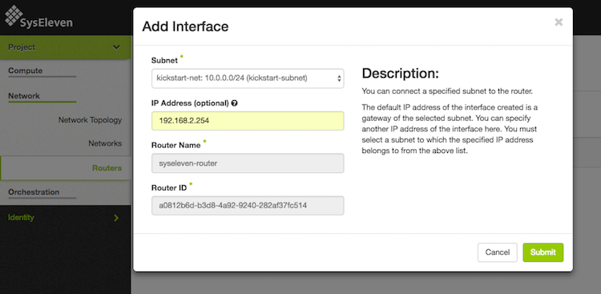

# SysEleven Stack Networking Service

[TOC]

## Übersicht

SysEleven Stacks Networking Service basiert auf dem OpenStack Neutron Projekt.

Sowohl via unserer öffentlichen OpenStack API, als auch durch das SysEleven Stack Dashboard können sie ihr virtualisierter Netzwerk verwalten.

### Wie verbinde ich 2 Subnetze miteinander?

####Vorraussetzungen:
* Zugang zum Dashboard
* min. 2 vorhandene Router/Stacks
* verschiedene IP-Ranges 

####Login

Mit den von SysEleven erhaltenen Daten für Nutzername und Passwort loggen wir uns ein unter https://dashboard.cloud.syseleven.net

####Interface im Router anlegen

Um ein Interface einzurichten, klicken wir zunächst in der linken Seitenleiste unter Network auf Routers.
Wählen dann den ersten Router für unsere Verbindung aus und klicken dafür auf den Namen.
Im sich nun öffnenden Fenster gehen wir auf den Reiter "Interfaces" und wählt dann "Add Interfaces" aus.
Hier wählt man im ersten Punkt den Ziel Router aus und vergibt unter IP eine eigene IP-Adresse (aus dem zugehörigen IP-Netz) und geht dann auf "Submit"
Diese Schritte wiederholt man nun für den anderen Router entsprechend. 

####Hostroute anlegen

Als nächsten Schritt benötigen wir noch eine Hostroute.
Dafür gehen wir in der Seitenleiste nun auf Network, wählen unser Netzwerk aus und klicken auf den Namen.
Dort sehen wir alle zugehörigen Subnetze, klicken bei dem zugehörigen Subnet auf "Edit Subnet" und wählen den Reite "Subnet Details".
Unter dem Punkt "Host Routes" können wir unsere Route festlegt.
Dafür legen wir unseren Ziel IP-Bereich fest (z.B. 10.0.0.0/24) und auch die IP Adresse des dazugehörigen Router Interfaces.
Mit "Submit" können wir das Ganze speichern und wiederholen es für das andere Subnet.

####Fazit

Nun haben wir zwei Subnetze verbunden, die untereinander kommunizieren können. 

Außerdem haben wir eine eigene Hostroute angelegt und auch verschiedene Unterpunkte im Dashboard kennengelernt.
