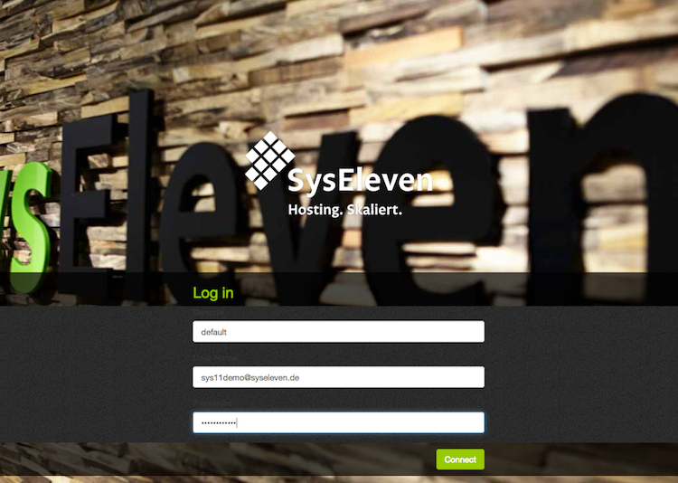

# SysEleven Stack Networking Service

[TOC]

## Overview

SysEleven Stacks Networking Service is built on the OpenStack Neutron project.

Via our public OpenStack API, as well as through our dashboard interface you are able to manage your virtualised networking.

## FAQ

### How do I connect 2 subnets with another?

#### Requirements

* Access to the dashboard
* min. 2 existing routers/networks
* different IP-ranges in both networks

#### Login

We log in with our credentials to the dasboard at https://dashboard.cloud.syseleven.net

#### Create interface in router

To create a new interface on our router, we click on the left side-bar, then "network" and "router".
Click on the first router we want to establish a connection with.
In the new window, under "interfaces" we click on "add interfaces".
As the first step we click on the router we want to connect to and add an IP under "IP" from the related subnet. Finally click in "Submit".
Repeat the above steps with the other router.

#### Creating the hostroute

The second step is to create the hostroute.
On the left side-bar we click on "network", and then click on the network we want to share.
We will now find all the related subnets. Click on the particular subnet you want to connect and "edit subnet" and go to "subnet details".
Under "host routes" we can now set the right route.
We have to specify our ip-range (e.g. 10.0.0.0/24) and the ip address of the specific router interface. Clicking "Submit" we can save our hostroute and repeat the process with the other subnet.

####Fazit

We now have connected two subnets, that can now communicate with another.

We have also set up our own hostroutes and got to know the networking settings in the dashboard.
