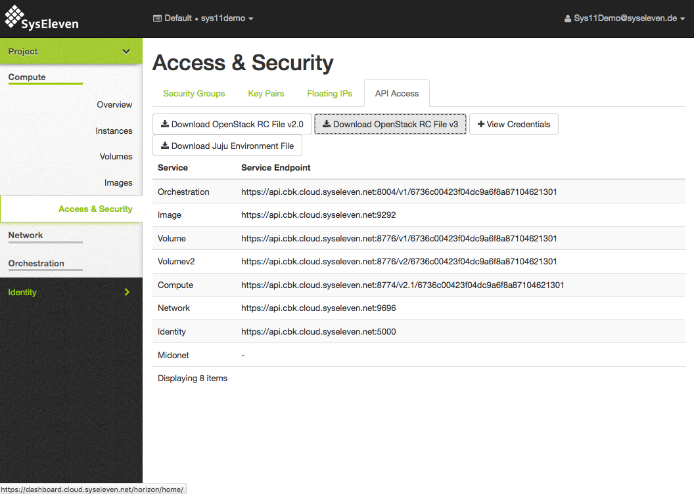
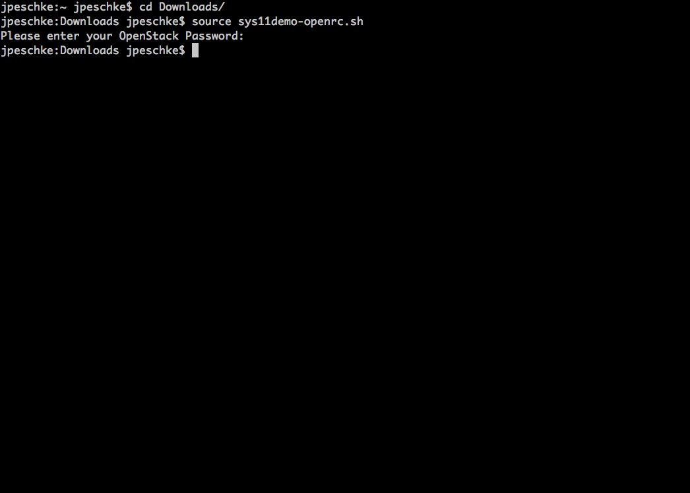

# SysEleven Stack API - Beginner Tutorial 

[TOC]

## Ziel

* Authentifizierung gegen die SysEleven Stack API
* Starten eines Beispiel-Stacks über die API

## Vorraussetzungen 

* Login-Daten für den SysEleven Stack liegen vor (Nutzername/ Passwort).
* Die Openstack-Commandline Clients sind in einer aktuellen Version installiert.
* Der Umgang mit einem Terminal ist vertraut.

## Zugriff auf die SysEleven Stack API

Um mit der API des SysEleven Stack zu arbeiten, werden in der Shell-Session Umgebungsvariablen benötigt, mit denen die jeweiligen Clients gegenüber der API authentifiziert und authorisiert werden. Als eingeloggter Benutzer kann man sich diese Umgebungsvariablen gesammelt in einer Datei im Dashboard herunterladen. Der Punkt ist zu finden unter "Compute" --> "Access & Security" --> "API Access". Dort wird durch einen Klick auf "Download OpenStack RC File v3" die entsprechende Datei heruntergeladen.
 


## Umgebungsvariablen in die Shell-Session einlesen 

Um den Clients die Angaben zur Authentifizierung und Authorisierung (Nutzername/Passwort/Projekt-Scope) für die jeweilige Session bekannt zu machen, lesen wir die heruntergeladene Datei ein:

```
source Downloads/sys11demo-openrc.sh
```



Das Einlesen der Umgebungsvariablen erzeugt kein Feedback auf dem Terminal, dies ist erwartetes Verhalten.

## Testen des Zugriffs

Wir können nun den OpenStack Client nehmen, um unseren Zugang zu testen:

```
jpeschke:~ jpeschke$ openstack network list
+--------------------------------------+---------+--------------------------------------+
| ID                                   | Name    | Subnets                              |
+--------------------------------------+---------+--------------------------------------+
| caf8de33-1059-4473-a2c1-2a62d12294fa | ext-net | 51a64106-3eb2-4172-9343-404a9f6b9993 |
+--------------------------------------+---------+--------------------------------------+
```

Wir sehen, dass als Rückgabewert der Netzwerk-Pool mit Floating-IPs zurückgegeben wird. Das ist die Bestätigung, dass erfolgreich mit der API des SysEleven Stack kommuniziert wurde.

## Starten eines Infrastruktur-Templates

Nun kann jede Infrastruktur-Komponente des SysEleven Stacks (Beispielsweise Netzwerk, Security-Groups oder virtuelle Maschinen) über die Commandline-Clients verwaltet werden. Um diesen Vorgang zusammenzufassen, kann auf Templates zurückgegriffen werden, in denen die Infrastruktur gesammelt beschreiben.
Beispielhafte Setups können von Github kopiert werden:

```
git clone https://github.com/syseleven/heattemplates-examples.git
```

Wir nehmen an dieser Stelle das aus Tutorial-01 bekannte LAMP-Setup und starten es dieses Mal über die API:

```
cd heattemplates-examples/lampServer
openstack stack create -t lamp.yaml --parameter key_name=sys11demokey lampstack
```

