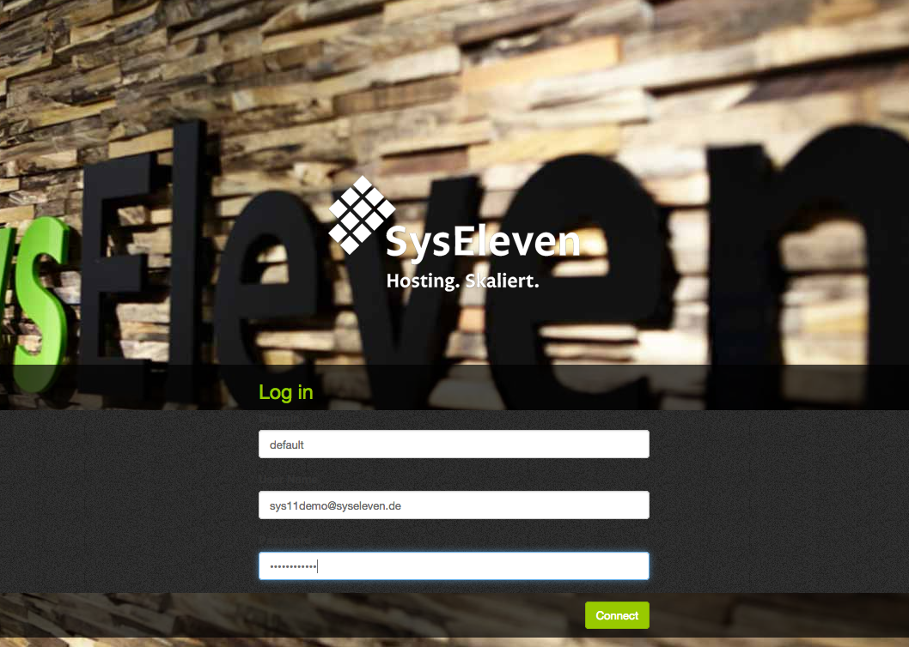
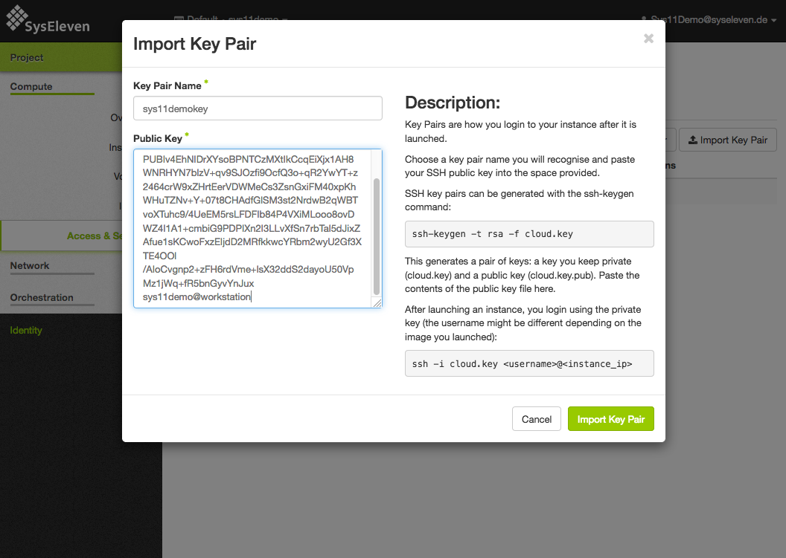
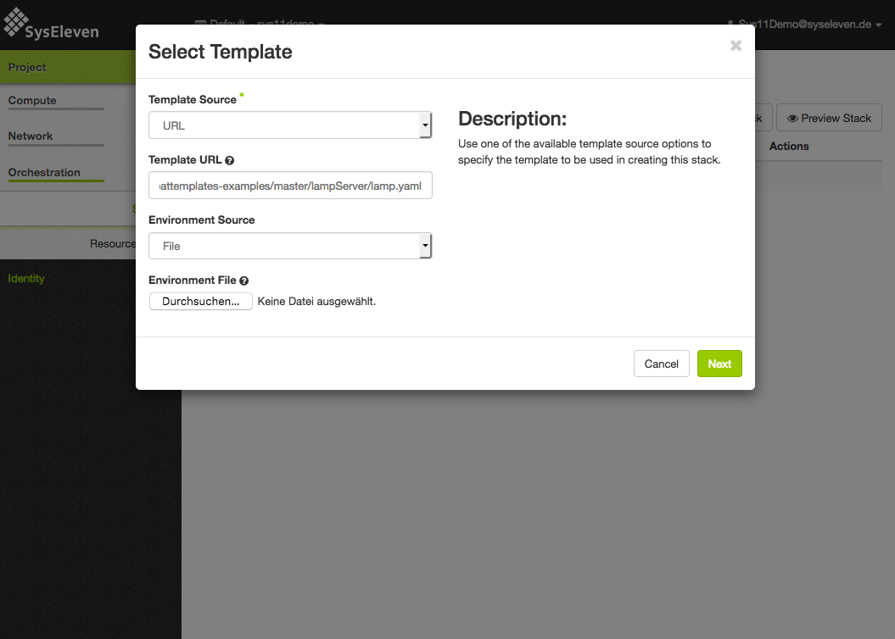
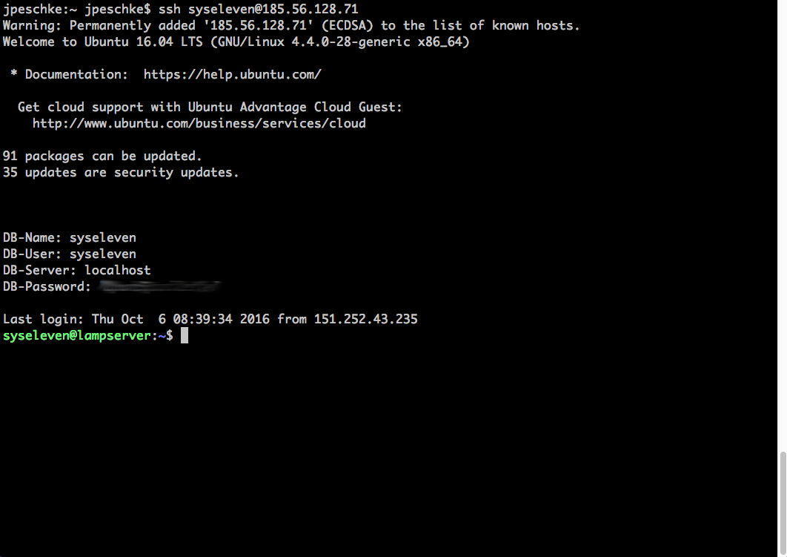

# Erste Schritte

[TOC]

## Ziel

* Start einer virtuellen Maschine
* Automatisierte Installation eines Webservers, eines Datenbankserver und einer Datenbank sowie PHP.

## Vorraussetzungen

Es wird davon ausgegangen, dass der Umgang mit SSH und SSH-Keys bekannt ist.

## Login

Mit den von SysEleven erhaltenen Daten für Nutzername und Passwort loggen wir
uns ein unter [https://dashboard.cloud.syseleven.net](https://dashboard.cloud.syseleven.net)



## SSH-Key hinterlegen

*    Um einen SSH-Key zu hinterlegen, bewegen wir uns im Dashboard in dem Reiter "Compute"
   zu "Access and Security" und dort zu dem Bereich "Key Pairs". Dort wählen wir "Import Key Pair" aus, wählen einen 
   Namen (den wir uns für die spätere Verwendung merken) und importieren per Copy & Paste unseren 
   öffentlichen SSH-Schlüssel. 



## Starten der Maschine

   Die URL zum Template [lamp.yaml](https://raw.githubusercontent.com/syseleven/heattemplates-examples/master/lampServer/lamp.yaml) kopieren wir per Copy&Paste in den Zwischenspeicher.

*    Unter *Orchestration --> Stacks --> Launch Stack* starten wir das Template. Das Input-Feld "Template Source" stellen wir um auf URL. Dort fügen wir per Copy&Paste
   die URL des Templates ein. Das Feld *Environment Source* belassen wir auf den Voreinstellungen und klicken auf "next".
   Im Feld "Stackname" wählen wir *lampserver*. Das "Password"-Feld ist an dieser Stelle irrelevant, muss aber mit beliebigem Text befüllt werden. 
   Als Parameter "key_name" geben wir den Namen an, den wir unserem öffentlichen SSH-Schlüssel vergeben haben.
   Danach klicken wir "Launch" und unsere erste Maschine startet.
  


## Login in den Server
*    Für den Login auf der eben erstellten Maschine  besorgen wir uns die IP-Adresse der virtuellen Maschine. Diese sehen wir unter *Compute* --> *Instances* im Feld "Floating IP" für die neu gebaute Maschine.  Mit folgendem Befehl können wir den Zugriff auf
   unsere Maschine unter Mac und Linux in einem Terminal testen:

```
ssh syseleven@<meineIP-Adresse>
```



*    Im Hintergrund wird nun der Webserver, der Datenbankserver, eine akutelle PHP-Version und eine Datenbank installiert bzw. angelegt.  
   Dem Fortschritt können wir folgen mit folgendem Befehl:


```
tail -f /var/log/cloud-init-output.log
```

   Nun kann eine beliebige PHP-Anwendung unter /var/www/html abgelegt und getestet werden.

